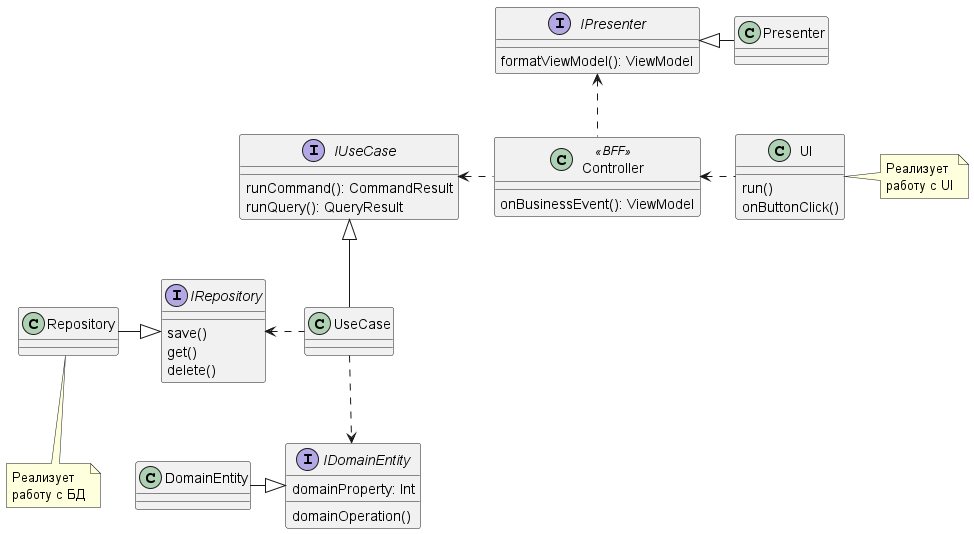

# Задание
Необходимо разработать приложение “Марсоход” по принципам TDD.

Космическое агентство планирует высадить группу роботов-марсоходов на красную планету с целью исследования плато прямоугольной формы. Предполагается, что бортовые камеры роботов фиксируют полный обзор окружающей местности и затем отправят сделанные снимки на Землю.

Позиция марсохода определяется двумя координатами: x и y. Положение камеры обозначается буквой, которая определяет одну из четырех сторон света. Например, 0, 0, N означает что робот стоит в левом нижнем углу и смотрит на север.

Управление марсоходом происходит путем отправки одной из трех команд - L, R или M. L и R означают поворот на 90 градусов в соответствующую сторону. M - перемещение на вперед на одну координату.

Первая строка входа - координаты верхнего правого угла плато. Координаты нижнего левого угла по умолчанию всегда равны 0, 0. Каждый робот имеет две строки ввода: первая означает текущее положение марсохода и направление камеры (две целых цифры и буква, разделенные пробелами), вторая - инструкции по передвижению.

Роботы передвигаются последовательно, т.е. следующий марсоход не начнет движение прежде, чем остановится текущий.

Пример тестового ввода:

* 5 5 ← верхний правый угол плато

* 1 2 N  ← текущее положение и направление камеры первого марсохода
* LMLMLMLMM ← управление положением первого марсохода

* 3 3 E ← текущее положение и направление камеры второго марсохода
* MMRMMRMRRM ← управление положением второго марсохода

Пример тестового вывода:

* 1 3 N ← конечное положение и направление камеры первого марсохода

* 5 1 E ← конечное положение и направление камеры второго марсохода

Есть усложненный вариант кстати
* Нельзя занимать уже занятые клетки
* Нельзя изначально ставить туда марсоход, а если дошел до занятой, то марсоход "упирается"

# Структура приложения

## Общая архитектура

### Пакеты, интерфейсы, классы

* domain - ex. IDataObject
* usecases - ex. IBusinessService
* repositories - ex. IDataService
* controllers - ex. DataObject.Operation
* presenters - ex. ListView, FormView 
* ui - ex. ListView, FormView
* config - ex. Application

+ Я Domain entity, я веду себя как объект реального мира
+ Я Repository, я умею сохранять и восстанавливать Domain Entities
+ Я UseCase, я умею манипулировать Domain Entities для решения задач приложения. Когда мне надо сохранить их, я обращаюсь к своему Repository
+ Я Controller, я умею реагировать на бизнес-события и вызывать UseCase'ы. Результат операции я должен вернуть в той форме (ViewModel), которая нужна UI. Но я не знаю UI, поэтому прошу подготовить ViewModel предложенного Presenter'а
+ Я UI, я умею рисовать поля и кнопки по переданной ViewModel. Когда их нажимают, я сообщаю о событии Controller'у и прошу его использовать для оформления выхода определенного Presenter'а

Виды ПИ:
+ Настольный / оконный: кнопки-команды и моментальная перерисовка по запросу
+ Веб: кнопки-команды и перерисовка по результату use-case'а
+ Телеграм: кнопки-команды и перерисовка по результату и по запросу

## Сервис: Field & Rovers
### Event storming

### Domain model
